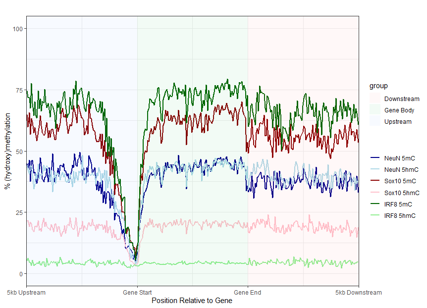

# Gene Body Plot
A plot to visualise average % methylation and % hydroxymethylation within the gene body and 5kb upstream and downstream of genes.  
The R script can be found here: [gene_body_plot.r](scripts/gene_body_plot.r)  
Test data (100,000 positions) can be found here: [nanopore_cov10_auto_100000.txt](data/nanopore_cov10_auto_100000.txt)  

##Example plot (using dataset provided)  

